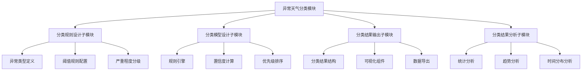
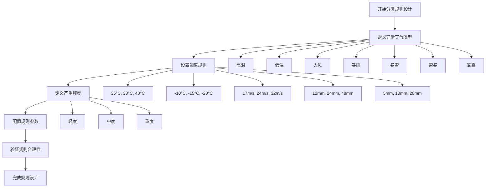
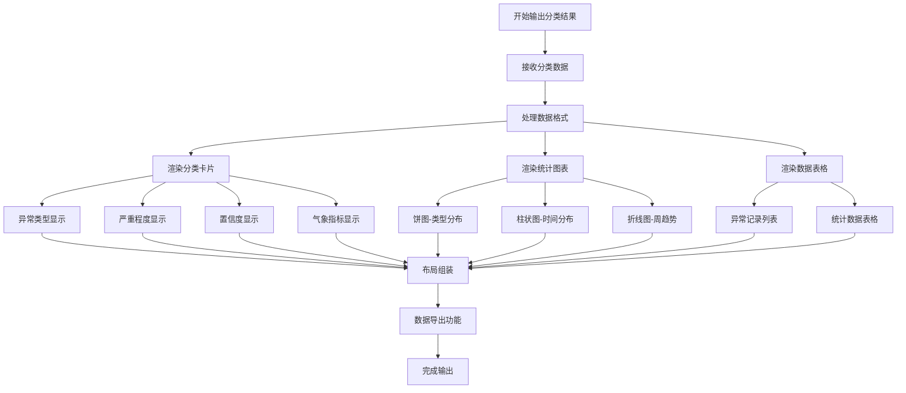
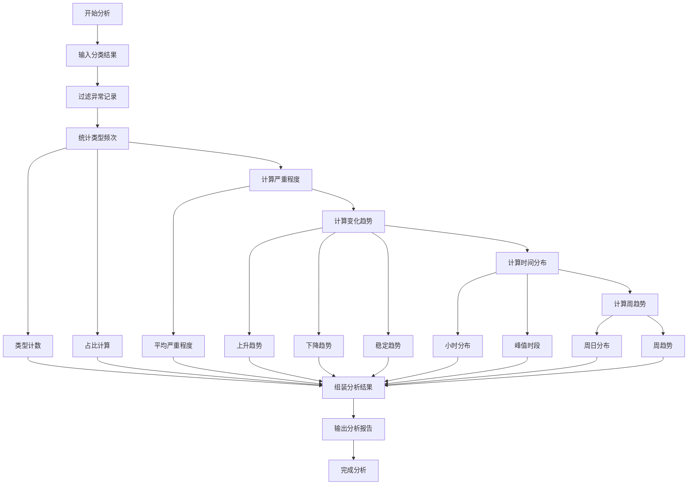
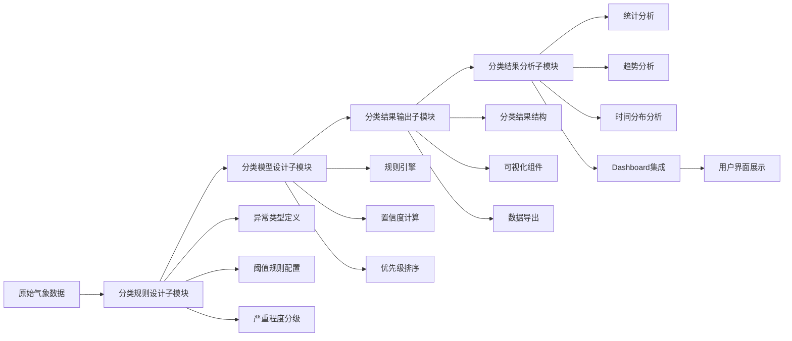

# 异常天气分类模块分析文档

## 模块概述

异常天气分类模块是一个基于规则的智能天气分类系统，能够根据温度、降水、风速等气象指标，自动识别和分类异常天气事件，并提供详细的统计分析功能。

## 模块架构



---

## 子模块一：分类规则设计子模块

### 1.1 设计思想

分类规则设计子模块是整个异常天气分类系统的基础，采用**基于阈值的规则引擎**设计思想：

- **标准化阈值体系**：为每种异常天气类型定义三级阈值（轻度、中度、重度）
- **多指标综合判定**：支持单指标和多指标组合判定
- **可配置性**：规则参数集中管理，便于调整和扩展
- **气象学标准**：基于气象学预警标准制定阈值

### 1.2 流程图



### 1.3 实现方法

#### 1.3.1 异常类型定义

使用TypeScript枚举定义8种异常天气类型：

```typescript
export type AnomalyWeatherType = 
  | '高温' 
  | '低温' 
  | '大风' 
  | '暴雨' 
  | '暴雪' 
  | '寒潮' 
  | '雷暴' 
  | '雾霾' 
  | '无异常';
```

#### 1.3.2 阈值规则配置

使用配置对象存储各异常类型的阈值和描述：

```typescript
const CLASSIFICATION_RULES = {
  highTemperature: {
    thresholds: [35, 38, 40],
    labels: ['轻度', '中度', '重度'] as const,
    description: '高温预警'
  },
  lowTemperature: {
    thresholds: [-10, -15, -20],
    labels: ['轻度', '中度', '重度'] as const,
    description: '低温预警'
  },
  strongWind: {
    thresholds: [17, 24, 32],
    labels: ['轻度', '中度', '重度'] as const,
    description: '大风预警'
  },
  heavyRain: {
    thresholds: [12, 24, 48],
    labels: ['轻度', '中度', '重度'] as const,
    description: '暴雨预警'
  },
  heavySnow: {
    thresholds: [5, 10, 20],
    labels: ['轻度', '中度', '重度'] as const,
    description: '暴雪预警'
  }
};
```

#### 1.3.3 严重程度分级

每个异常类型分为三个严重程度等级：

| 等级 | 含义 | 处理建议 |
|------|------|----------|
| 轻度 | 指标轻微超出正常范围 | 持续观察，做好预防 |
| 中度 | 指标明显超出正常范围 | 启动预警，准备应对措施 |
| 重度 | 指标严重超出正常范围 | 紧急响应，启动应急预案 |

### 1.4 对应代码

**文件位置**: `src/utils/anomalyClassifier.ts`

```typescript
// 异常天气类型定义
export type AnomalyWeatherType = 
  | '高温' | '低温' | '大风' | '暴雨' 
  | '暴雪' | '寒潮' | '雷暴' | '雾霾' | '无异常';

// 分类规则配置
const CLASSIFICATION_RULES = {
  highTemperature: {
    thresholds: [35, 38, 40],
    labels: ['轻度', '中度', '重度'] as const,
    description: '高温预警'
  },
  lowTemperature: {
    thresholds: [-10, -15, -20],
    labels: ['轻度', '中度', '重度'] as const,
    description: '低温预警'
  },
  strongWind: {
    thresholds: [17, 24, 32],
    labels: ['轻度', '中度', '重度'] as const,
    description: '大风预警'
  },
  heavyRain: {
    thresholds: [12, 24, 48],
    labels: ['轻度', '中度', '重度'] as const,
    description: '暴雨预警'
  },
  heavySnow: {
    thresholds: [5, 10, 20],
    labels: ['轻度', '中度', '重度'] as const,
    description: '暴雪预警'
  }
};
```

---

## 子模块二：分类模型设计子模块

### 2.1 设计思想

分类模型设计子模块采用**基于规则的优先级排序算法**：

- **多条件并行判定**：同时检查所有异常条件
- **置信度评分机制**：根据指标偏离程度计算置信度
- **优先级冲突解决**：当满足多个异常条件时，按置信度排序选择
- **可解释性**：每个分类结果都有明确的判定依据

### 2.2 流程图

```mermaid
flowchart TD
    Start[开始分类] --> Input[输入气象记录]
    Input --> CheckHighTemp{温度≥35°C?}
    CheckHighTemp -->|是| CalcHighTemp[计算高温严重程度]
    CheckHighTemp -->|否| CheckLowTemp{温度≤-10°C?}
    
    CalcHighTemp --> AddHighTemp[添加高温分类候选]
    AddHighTemp --> CheckLowTemp
    
    CheckLowTemp -->|是| CalcLowTemp[计算低温严重程度]
    CheckLowTemp -->|否| CheckWind{风速≥17m/s?}
    
    CalcLowTemp --> AddLowTemp[添加低温分类候选]
    AddLowTemp --> CheckWind
    
    CheckWind -->|是| CalcWind[计算大风严重程度]
    CheckWind -->|否| CheckRain{降水≥12mm且温度>0°C?}
    
    CalcWind --> AddWind[添加大风分类候选]
    AddWind --> CheckRain
    
    CheckRain -->|是| CalcRain[计算暴雨严重程度]
    CheckRain -->|否| CheckSnow{降水≥5mm且温度≤0°C?}
    
    CalcRain --> AddRain[添加暴雨分类候选]
    AddRain --> CheckSnow
    
    CheckSnow -->|是| CalcSnow[计算暴雪严重程度]
    CheckSnow -->|否| CheckThunder{湿度>90%且气压<1000?}
    
    CalcSnow --> AddSnow[添加暴雪分类候选]
    AddSnow --> CheckThunder
    
    CheckThunder -->|是| AddThunder[添加雷暴分类候选]
    CheckThunder -->|否| CheckFog{湿度>95%且低能见度?}
    
    AddThunder --> CheckFog
    
    CheckFog -->|是| AddFog[添加雾霾分类候选]
    CheckFog -->|否| CheckEmpty{有分类候选?}
    
    AddFog --> CheckEmpty
    
    CheckEmpty -->|否| ReturnNormal[返回无异常]
    CheckEmpty -->|是| SortConfidence[按置信度排序]
    
    SortConfidence --> SelectTop[选择最高置信度分类]
    SelectTop --> ReturnResult[返回分类结果]
    
    ReturnNormal --> End[结束]
    ReturnResult --> End
```



### 2.3 实现方法

#### 2.3.1 规则引擎实现

```typescript
export function classifyAnomalyWeather(record: MeteorologicalRecord): AnomalyWeatherClassification {
  const { temperature, windSpeed, precipitation, humidity, pressure, timestamp } = record;
  
  const classifications: Array<{
    type: AnomalyWeatherType;
    severity: '轻度' | '中度' | '重度';
    confidence: number;
    indicators: Record<string, number>;
  }> = [];

  // 高温判定
  if (temperature >= CLASSIFICATION_RULES.highTemperature.thresholds[0]) {
    const [t1, t2, t3] = CLASSIFICATION_RULES.highTemperature.thresholds;
    let severity: '轻度' | '中度' | '重度' = '轻度';
    let confidence = 0.7;
    
    if (temperature >= t3) {
      severity = '重度';
      confidence = 0.95;
    } else if (temperature >= t2) {
      severity = '中度';
      confidence = 0.85;
    } else if (temperature >= t1) {
      severity = '轻度';
      confidence = 0.75;
    }
    
    classifications.push({
      type: '高温',
      severity,
      confidence,
      indicators: { temperature }
    });
  }

  // 其他异常类型判定...
  
  if (classifications.length === 0) {
    return {
      timestamp,
      type: '无异常',
      severity: '轻度',
      indicators: {},
      confidence: 1.0
    };
  }

  // 按置信度排序，选择最高置信度的分类
  classifications.sort((a, b) => b.confidence - a.confidence);
  
  return {
    timestamp,
    type: classifications[0].type,
    severity: classifications[0].severity,
    indicators: classifications[0].indicators,
    confidence: classifications[0].confidence
  };
}
```

#### 2.3.2 置信度计算

置信度根据指标偏离阈值的程度计算：

| 偏离程度 | 置信度 | 说明 |
|----------|--------|------|
| 轻度偏离 | 0.70-0.75 | 指标刚超过轻度阈值 |
| 中度偏离 | 0.80-0.85 | 指标超过中度阈值 |
| 重度偏离 | 0.90-0.95 | 指标超过重度阈值 |

#### 2.3.3 优先级排序

当满足多个异常条件时，按以下规则排序：
1. 置信度高的优先
2. 严重程度高的优先
3. 多指标组合的优先

### 2.4 对应代码

**文件位置**: `src/utils/anomalyClassifier.ts`

```typescript
export function classifyAnomalyWeather(record: MeteorologicalRecord): AnomalyWeatherClassification {
  const { temperature, windSpeed, precipitation, humidity, pressure, timestamp } = record;
  
  const classifications: Array<{
    type: AnomalyWeatherType;
    severity: '轻度' | '中度' | '重度';
    confidence: number;
    indicators: Record<string, number>;
  }> = [];

  // 高温判定规则
  if (temperature >= CLASSIFICATION_RULES.highTemperature.thresholds[0]) {
    const [t1, t2, t3] = CLASSIFICATION_RULES.highTemperature.thresholds;
    let severity: '轻度' | '中度' | '重度' = '轻度';
    let confidence = 0.7;
    
    if (temperature >= t3) {
      severity = '重度';
      confidence = 0.95;
    } else if (temperature >= t2) {
      severity = '中度';
      confidence = 0.85;
    } else if (temperature >= t1) {
      severity = '轻度';
      confidence = 0.75;
    }
    
    classifications.push({
      type: '高温',
      severity,
      confidence,
      indicators: { temperature }
    });
  }

  // 低温判定规则
  if (temperature <= CLASSIFICATION_RULES.lowTemperature.thresholds[0]) {
    const [t1, t2, t3] = CLASSIFICATION_RULES.lowTemperature.thresholds;
    let severity: '轻度' | '中度' | '重度' = '轻度';
    let confidence = 0.7;
    
    if (temperature <= t3) {
      severity = '重度';
      confidence = 0.95;
    } else if (temperature <= t2) {
      severity = '中度';
      confidence = 0.85;
    } else if (temperature <= t1) {
      severity = '轻度';
      confidence = 0.75;
    }
    
    classifications.push({
      type: '低温',
      severity,
      confidence,
      indicators: { temperature }
    });
  }

  // 大风判定规则
  if (windSpeed >= CLASSIFICATION_RULES.strongWind.thresholds[0]) {
    const [t1, t2, t3] = CLASSIFICATION_RULES.strongWind.thresholds;
    let severity: '轻度' | '中度' | '重度' = '轻度';
    let confidence = 0.7;
    
    if (windSpeed >= t3) {
      severity = '重度';
      confidence = 0.95;
    } else if (windSpeed >= t2) {
      severity = '中度';
      confidence = 0.85;
    } else if (windSpeed >= t1) {
      severity = '轻度';
      confidence = 0.75;
    }
    
    classifications.push({
      type: '大风',
      severity,
      confidence,
      indicators: { windSpeed }
    });
  }

  // 暴雨判定规则（温度>0°C）
  if (precipitation >= CLASSIFICATION_RULES.heavyRain.thresholds[0] && temperature > 0) {
    const [t1, t2, t3] = CLASSIFICATION_RULES.heavyRain.thresholds;
    let severity: '轻度' | '中度' | '重度' = '轻度';
    let confidence = 0.7;
    
    if (precipitation >= t3) {
      severity = '重度';
      confidence = 0.95;
    } else if (precipitation >= t2) {
      severity = '中度';
      confidence = 0.85;
    } else if (precipitation >= t1) {
      severity = '轻度';
      confidence = 0.75;
    }
    
    classifications.push({
      type: '暴雨',
      severity,
      confidence,
      indicators: { precipitation, temperature }
    });
  }

  // 暴雪判定规则（温度≤0°C）
  if (precipitation >= CLASSIFICATION_RULES.heavySnow.thresholds[0] && temperature <= 0) {
    const [t1, t2, t3] = CLASSIFICATION_RULES.heavySnow.thresholds;
    let severity: '轻度' | '中度' | '重度' = '轻度';
    let confidence = 0.7;
    
    if (precipitation >= t3) {
      severity = '重度';
      confidence = 0.95;
    } else if (precipitation >= t2) {
      severity = '中度';
      confidence = 0.85;
    } else if (precipitation >= t1) {
      severity = '轻度';
      confidence = 0.75;
    }
    
    classifications.push({
      type: '暴雪',
      severity,
      confidence,
      indicators: { precipitation, temperature }
    });
  }

  // 雷暴判定规则（多指标组合）
  if (humidity > 90 && pressure < 1000) {
    classifications.push({
      type: '雷暴',
      severity: '轻度',
      confidence: 0.7,
      indicators: { humidity, pressure }
    });
  }

  // 雾霾判定规则（多指标组合）
  if (humidity > 95 && visibilityLow(humidity, pressure)) {
    classifications.push({
      type: '雾霾',
      severity: '中度',
      confidence: 0.8,
      indicators: { humidity, pressure }
    });
  }

  // 无异常情况
  if (classifications.length === 0) {
    return {
      timestamp,
      type: '无异常',
      severity: '轻度',
      indicators: {},
      confidence: 1.0
    };
  }

  // 按置信度排序，选择最高置信度的分类
  classifications.sort((a, b) => b.confidence - a.confidence);
  
  return {
    timestamp,
    type: classifications[0].type,
    severity: classifications[0].severity,
    indicators: classifications[0].indicators,
    confidence: classifications[0].confidence
  };
}

// 辅助函数：判断低能见度
function visibilityLow(humidity: number, pressure: number): boolean {
  return humidity > 90 && pressure < 1005;
}
```

---

## 子模块三：分类结果输出子模块

### 3.1 设计思想

分类结果输出子模块采用**组件化可视化**设计思想：

- **结构化数据输出**：定义标准化的分类结果数据结构
- **多维度展示**：提供卡片、图表、表格等多种展示方式
- **实时更新**：支持数据变化时的实时渲染
- **用户友好**：直观的界面设计和交互体验

### 3.2 流程图



### 3.3 实现方法

#### 3.3.1 分类结果数据结构

```typescript
export interface AnomalyWeatherClassification {
  timestamp: string;           // 异常时间
  type: AnomalyWeatherType;    // 异常类型
  severity: '轻度' | '中度' | '重度';  // 严重程度
  indicators: {                // 相关气象指标
    temperature?: number;
    windSpeed?: number;
    precipitation?: number;
    humidity?: number;
    pressure?: number;
  };
  confidence: number;          // 置信度 (0-1)
}
```

#### 3.3.2 分类卡片组件

```typescript
export const AnomalyClassificationCard: React.FC<AnomalyClassificationCardProps> = ({ classification }) => {
  const { type, severity, confidence, indicators, timestamp } = classification;
  const typeColor = getAnomalyTypeColor(type);
  const severityColor = getSeverityColor(severity);
  
  return (
    <div className="bg-white rounded-xl p-4 border border-gray-100 shadow-sm">
      <div className="flex items-start justify-between mb-3">
        <div className="flex items-center gap-2">
          <div className="w-3 h-3 rounded-full" style={{ backgroundColor: typeColor }} />
          <span className="font-semibold text-gray-800">{type}</span>
        </div>
        <span className="px-2 py-1 rounded-full text-xs font-bold"
              style={{ backgroundColor: `${severityColor}20`, color: severityColor }}>
          {severity}
        </span>
      </div>
      <div className="text-sm text-gray-500 mb-3">{timestamp}</div>
      <div className="space-y-2 mb-3">
        {Object.entries(indicators).map(([key, value]) => (
          <div key={key} className="flex justify-between items-center text-sm">
            <span className="text-gray-500">{key}</span>
            <span className="font-mono font-bold text-gray-700">{value}</span>
          </div>
        ))}
      </div>
      <div className="flex items-center justify-between text-xs">
        <span className="text-gray-400">置信度</span>
        <span className="font-mono font-bold text-indigo-600">{(confidence * 100).toFixed(0)}%</span>
      </div>
    </div>
  );
};
```

#### 3.3.3 统计图表组件

```typescript
export const AnomalyStatsChart: React.FC<AnomalyStatsChartProps> = ({ statistics }) => {
  const topStats = statistics.slice(0, 6);
  
  const option = {
    title: {
      text: '异常天气类型分布统计',
      left: 'center',
      textStyle: { fontSize: 15, fontWeight: 600, color: '#1f2937' },
      top: 10,
    },
    tooltip: {
      trigger: 'item',
      formatter: (params: any) => {
        const stat = topStats.find(s => s.type === params.name);
        return `<div class="p-2 font-sans">
          <div class="font-bold text-gray-800 text-sm">${params.name}</div>
          <div class="text-xs text-gray-600 mt-1">
            数量: ${params.value} 次<br/>
            占比: ${params.percent.toFixed(1)}%<br/>
            平均等级: ${stat?.avgSeverity.toFixed(1)}
          </div>
        </div>`;
      },
    },
    series: [{
      name: '异常天气',
      type: 'pie',
      radius: ['45%', '70%'],
      data: topStats.map(stat => ({
        value: stat.count,
        name: stat.type,
        itemStyle: { color: getAnomalyTypeColor(stat.type) },
      })),
    }],
  };

  return (
    <div className="w-full h-[350px] bg-white rounded-2xl p-4 shadow-sm border border-gray-100">
      <ReactECharts option={option} className="w-full h-full" />
    </div>
  );
};
```

### 3.4 对应代码

**文件位置**: `src/components/AnomalyClassification.tsx`

```typescript
import React from 'react';
import ReactECharts from 'echarts-for-react';
import { AnomalyWeatherAnalysis, AnomalyWeatherClassification, AnomalyWeatherStats } from '../types';
import { getAnomalyTypeColor, getSeverityColor, getAnomalyTypeDescription } from '../utils/anomalyClassifier';

// 分类卡片组件
export const AnomalyClassificationCard: React.FC<AnomalyClassificationCardProps> = ({ classification }) => {
  const { type, severity, confidence, indicators, timestamp } = classification;
  const typeColor = getAnomalyTypeColor(type);
  const severityColor = getSeverityColor(severity);
  
  const indicatorDisplay = Object.entries(indicators).map(([key, value]) => {
    const labelMap: Record<string, string> = {
      temperature: '温度',
      windSpeed: '风速',
      precipitation: '降水量',
      humidity: '湿度',
      pressure: '气压'
    };
    const unitMap: Record<string, string> = {
      temperature: '°C',
      windSpeed: 'm/s',
      precipitation: 'mm',
      humidity: '%',
      pressure: 'hPa'
    };
    return (
      <div key={key} className="flex justify-between items-center text-sm">
        <span className="text-gray-500">{labelMap[key] || key}</span>
        <span className="font-mono font-bold text-gray-700">{value} {unitMap[key] || ''}</span>
      </div>
    );
  });

  return (
    <div className="bg-white rounded-xl p-4 border border-gray-100 shadow-sm hover:shadow-md transition-shadow">
      <div className="flex items-start justify-between mb-3">
        <div className="flex items-center gap-2">
          <div className="w-3 h-3 rounded-full" style={{ backgroundColor: typeColor }} />
          <span className="font-semibold text-gray-800">{type}</span>
        </div>
        <span className="px-2 py-1 rounded-full text-xs font-bold"
              style={{ backgroundColor: `${severityColor}20`, color: severityColor }}>
          {severity}
        </span>
      </div>
      
      <div className="text-sm text-gray-500 mb-3">{timestamp}</div>
      
      <div className="space-y-2 mb-3">
        {indicatorDisplay}
      </div>
      
      <div className="flex items-center justify-between text-xs">
        <span className="text-gray-400">置信度</span>
        <span className="font-mono font-bold text-indigo-600">{(confidence * 100).toFixed(0)}%</span>
      </div>
    </div>
  );
};

// 统计图表组件
export const AnomalyStatsChart: React.FC<AnomalyStatsChartProps> = ({ statistics }) => {
  const topStats = statistics.slice(0, 6);
  
  const option = {
    title: {
      text: '异常天气类型分布统计',
      left: 'center',
      textStyle: { fontSize: 15, fontWeight: 600, color: '#1f2937' },
      top: 10,
    },
    tooltip: {
      trigger: 'item',
      backgroundColor: 'rgba(255, 255, 255, 0.98)',
      borderWidth: 1,
      borderColor: '#e5e7eb',
      formatter: (params: any) => {
        const stat = topStats.find(s => s.type === params.name);
        return `<div class="p-2 font-sans">
          <div class="font-bold text-gray-800 text-sm">${params.name}</div>
          <div class="text-xs text-gray-600 mt-1">
            数量: ${params.value} 次<br/>
            占比: ${params.percent.toFixed(1)}%<br/>
            平均等级: ${stat?.avgSeverity.toFixed(1)}
          </div>
        </div>`;
      },
    },
    legend: {
      orient: 'horizontal',
      bottom: 10,
      textStyle: { color: '#4b5563' },
    },
    series: [{
      name: '异常天气',
      type: 'pie',
      radius: ['45%', '70%'],
      center: ['50%', '50%'],
      avoidLabelOverlap: false,
      itemStyle: {
        borderRadius: 8,
        borderColor: '#fff',
        borderWidth: 2,
      },
      label: {
        show: true,
        formatter: '{b}\n{d}%',
        fontSize: 11,
        color: '#4b5563',
      },
      emphasis: {
        label: {
          show: true,
          fontSize: 13,
          fontWeight: 'bold',
        },
        itemStyle: {
          shadowBlur: 10,
          shadowColor: 'rgba(0, 0, 0, 0.2)',
        },
      },
      labelLine: {
        show: true,
        length: 15,
        length2: 10,
      },
      data: topStats.map(stat => ({
        value: stat.count,
        name: stat.type,
        itemStyle: { color: getAnomalyTypeColor(stat.type) },
      })),
    }],
  };

  return (
    <div className="w-full h-[350px] bg-white rounded-2xl p-4 shadow-sm border border-gray-100">
      <ReactECharts option={option} className="w-full h-full" style={{ height: '100%', width: '100%' }} />
    </div>
  );
};

// 时间分布图表组件
export const AnomalyTimeDistributionChart: React.FC<AnomalyTimeDistributionChartProps> = ({ timeDistribution }) => {
  const option = {
    title: {
      text: '异常天气小时分布',
      left: 'center',
      textStyle: { fontSize: 15, fontWeight: 600, color: '#1f2937' },
      top: 10,
    },
    tooltip: {
      trigger: 'axis',
      axisPointer: { type: 'shadow' },
      backgroundColor: 'rgba(255, 255, 255, 0.98)',
      borderWidth: 1,
      borderColor: '#e5e7eb',
    },
    grid: {
      top: '18%',
      bottom: '12%',
      left: '8%',
      right: '8%',
      containLabel: true,
    },
    xAxis: {
      type: 'category',
      data: timeDistribution.map(d => `${d.hour}:00`),
      name: '时段',
      axisLabel: { color: '#4b5563', interval: 2 },
    },
    yAxis: {
      type: 'value',
      name: '异常次数',
      splitLine: { lineStyle: { color: '#f3f4f6' } },
    },
    series: [{
      name: '异常次数',
      type: 'bar',
      data: timeDistribution.map(d => ({
        value: d.count,
        itemStyle: {
          color: {
            type: 'linear',
            x: 0, y: 0, x2: 0, y2: 1,
            colorStops: [
              { offset: 0, color: '#3b82f6' },
              { offset: 1, color: '#06b6d4' },
            ],
          },
          borderRadius: [4, 4, 0, 0],
        },
      })),
    }],
  };

  return (
    <div className="w-full h-[300px] bg-white rounded-2xl p-4 shadow-sm border border-gray-100">
      <ReactECharts option={option} className="w-full h-full" style={{ height: '100%', width: '100%' }} />
    </div>
  );
};

// 周趋势图表组件
export const AnomalyWeeklyTrendChart: React.FC<AnomalyWeeklyTrendChartProps> = ({ weeklyTrend }) => {
  const option = {
    title: {
      text: '异常天气周分布趋势',
      left: 'center',
      textStyle: { fontSize: 15, fontWeight: 600, color: '#1f2937' },
      top: 10,
    },
    tooltip: {
      trigger: 'axis',
      backgroundColor: 'rgba(255, 255, 255, 0.98)',
      borderWidth: 1,
      borderColor: '#e5e7eb',
    },
    grid: {
      top: '18%',
      bottom: '12%',
      left: '8%',
      right: '8%',
      containLabel: true,
    },
    xAxis: {
      type: 'category',
      data: weeklyTrend.map(d => d.day),
      name: '星期',
      axisLabel: { color: '#4b5563' },
    },
    yAxis: {
      type: 'value',
      name: '异常次数',
      splitLine: { lineStyle: { color: '#f3f4f6' } },
    },
    series: [{
      name: '异常次数',
      type: 'line',
      smooth: true,
      data: weeklyTrend.map(d => d.count),
      lineStyle: { width: 3, color: '#8b5cf6' },
      itemStyle: { color: '#8b5cf6' },
      areaStyle: {
        color: {
          type: 'linear',
          x: 0, y: 0, x2: 0, y2: 1,
          colorStops: [
            { offset: 0, color: 'rgba(139, 92, 246, 0.3)' },
            { offset: 1, color: 'rgba(139, 92, 246, 0.05)' },
          ],
        },
      },
      symbol: 'circle',
      symbolSize: 8,
    }],
  };

  return (
    <div className="w-full h-[300px] bg-white rounded-2xl p-4 shadow-sm border border-gray-100">
      <ReactECharts option={option} className="w-full h-full" style={{ height: '100%', width: '100%' }} />
    </div>
  );
};

// 综合分析面板组件
export const AnomalyClassificationPanel: React.FC<AnomalyClassificationPanelProps> = ({ analysis }) => {
  const { totalAnomalies, classifiedRecords, statistics, timeDistribution, weeklyTrend } = analysis;
  
  const anomalyRecords = classifiedRecords.filter(r => r.type !== '无异常');
  const recentAnomalies = anomalyRecords.slice(-6);
  
  const trendColors: Record<string, string> = {
    increasing: '#ef4444',
    decreasing: '#22c55e',
    stable: '#6b7280'
  };

  return (
    <div className="space-y-6">
      <div className="flex items-center justify-between">
        <h2 className="text-xl font-bold text-gray-800">异常天气分类分析</h2>
        <div className="flex items-center gap-2 px-4 py-2 bg-indigo-50 rounded-full">
          <span className="w-2 h-2 bg-indigo-500 rounded-full animate-pulse" />
          <span className="text-sm font-semibold text-indigo-700">共检测 {totalAnomalies} 次异常</span>
        </div>
      </div>

      <div className="grid grid-cols-1 lg:grid-cols-3 gap-6">
        <div className="lg:col-span-2">
          <AnomalyStatsChart statistics={statistics} />
        </div>
        
        <div className="bg-white rounded-2xl p-4 shadow-sm border border-gray-100">
          <h3 className="font-semibold text-gray-800 mb-4">异常类型统计</h3>
          <div className="space-y-3">
            {statistics.slice(0, 5).map((stat, index) => (
              <div key={stat.type} className="flex items-center justify-between">
                <div className="flex items-center gap-2">
                  <span className="text-sm font-medium text-gray-600">#{index + 1}</span>
                  <div className="w-2 h-2 rounded-full" style={{ backgroundColor: getAnomalyTypeColor(stat.type) }} />
                  <span className="text-sm text-gray-700">{stat.type}</span>
                </div>
                <div className="flex items-center gap-2">
                  <span className="text-sm font-bold text-gray-800">{stat.count}</span>
                  <span className="text-xs font-medium px-1.5 py-0.5 rounded"
                        style={{ 
                          backgroundColor: `${trendColors[stat.trend]}20`, 
                          color: trendColors[stat.trend] 
                        }}>
                    {stat.trend === 'increasing' ? '↑ 上升' : stat.trend === 'decreasing' ? '↓ 下降' : '→ 稳定'}
                  </span>
                </div>
              </div>
            ))}
          </div>
        </div>
      </div>

      <div className="grid grid-cols-1 lg:grid-cols-2 gap-6">
        <AnomalyTimeDistributionChart timeDistribution={timeDistribution} />
        <AnomalyWeeklyTrendChart weeklyTrend={weeklyTrend} />
      </div>

      <div>
        <div className="flex items-center justify-between mb-4">
          <h3 className="font-semibold text-gray-800">最近异常记录</h3>
          <button className="text-sm text-indigo-600 hover:text-indigo-700 font-medium">
            查看全部
          </button>
        </div>
        <div className="grid grid-cols-1 md:grid-cols-2 lg:grid-cols-3 gap-4">
          {recentAnomalies.map((classification, index) => (
            <AnomalyClassificationCard key={index} classification={classification} />
          ))}
          {recentAnomalies.length === 0 && (
            <div className="col-span-full text-center py-8 text-gray-400">
              暂无异常记录
            </div>
          )}
        </div>
      </div>

      <div className="bg-white rounded-2xl p-4 shadow-sm border border-gray-100">
        <h3 className="font-semibold text-gray-800 mb-4">异常类型说明</h3>
        <div className="grid grid-cols-2 md:grid-cols-3 lg:grid-cols-4 gap-3">
          {['高温', '低温', '大风', '暴雨', '暴雪', '寒潮', '雷暴', '雾霾'].map(type => (
            <div key={type} className="p-3 rounded-lg bg-gray-50 hover:bg-gray-100 transition-colors">
              <div className="flex items-center gap-2 mb-1">
                <div className="w-2 h-2 rounded-full" style={{ backgroundColor: getAnomalyTypeColor(type as any) }} />
                <span className="font-medium text-gray-700 text-sm">{type}</span>
              </div>
              <p className="text-xs text-gray-500 line-clamp-2">
                {getAnomalyTypeDescription(type as any)}
              </p>
            </div>
          ))}
        </div>
      </div>
    </div>
  );
};
```

---

## 子模块四：分类结果分析子模块

### 4.1 设计思想

分类结果分析子模块采用**统计分析+趋势预测**设计思想：

- **多维度统计**：从频率、占比、严重程度等多个维度分析
- **趋势识别**：识别异常天气的变化趋势（上升/下降/稳定）
- **时间模式分析**：分析异常天气的时间分布规律
- **可视化展示**：通过图表直观展示分析结果

### 4.2 流程图



### 4.3 实现方法

#### 4.3.1 统计分析函数

```typescript
export function analyzeAnomalyWeather(records: MeteorologicalRecord[]): AnomalyWeatherAnalysis {
  const classifiedRecords = records.map(classifyAnomalyWeather);
  
  const anomalyRecords = classifiedRecords.filter(r => r.type !== '无异常');
  const totalAnomalies = anomalyRecords.length;

  const typeCounts = new Map<AnomalyWeatherType, number>();
  const typeSeverities = new Map<AnomalyWeatherType, number[]>();
  const typeTimestamps = new Map<AnomalyWeatherType, string[]>();
  
  anomalyRecords.forEach(record => {
    typeCounts.set(record.type, (typeCounts.get(record.type) || 0) + 1);
    const severityValue = record.severity === '轻度' ? 1 : record.severity === '中度' ? 2 : 3;
    typeSeverities.set(record.type, [...(typeSeverities.get(record.type) || []), severityValue]);
    typeTimestamps.set(record.type, [...(typeTimestamps.get(record.type) || []), record.timestamp]);
  });

  const statistics: AnomalyWeatherStats[] = [];
  typeCounts.forEach((count, type) => {
    const severities = typeSeverities.get(type) || [];
    const avgSeverity = severities.length > 0 
      ? severities.reduce((a, b) => a + b, 0) / severities.length 
      : 0;
    const timestamps = typeTimestamps.get(type) || [];
    const trend = calculateTrend(timestamps);
    
    statistics.push({
      type,
      count,
      percentage: totalAnomalies > 0 ? (count / totalAnomalies) * 100 : 0,
      avgSeverity,
      trend,
      recentOccurrences: timestamps.slice(-5)
    });
  });

  statistics.sort((a, b) => b.count - a.count);

  const timeDistribution = Array.from({ length: 24 }, (_, hour) => ({
    hour,
    count: anomalyRecords.filter(r => {
      const hourOfDay = new Date(r.timestamp).getHours();
      return hourOfDay === hour;
    }).length
  }));

  const dayOrder = ['周日', '周一', '周二', '周三', '周四', '周五', '周六'];
  const weeklyTrend = dayOrder.map((day, index) => ({
    day,
    count: anomalyRecords.filter(r => {
      const dayOfWeek = new Date(r.timestamp).getDay();
      return dayOfWeek === index;
    }).length
  }));

  return {
    totalAnomalies,
    classifiedRecords,
    statistics,
    timeDistribution,
    weeklyTrend
  };
}
```

#### 4.3.2 趋势计算函数

```typescript
function calculateTrend(timestamps: string[]): 'increasing' | 'decreasing' | 'stable' {
  if (timestamps.length < 2) return 'stable';
  
  timestamps.sort();
  
  const recent = timestamps.slice(-7);
  const earlier = timestamps.slice(0, Math.min(7, timestamps.length));
  
  const recentDays = new Set(recent.map(t => t.split(' ')[0])).size;
  const earlierDays = new Set(earlier.map(t => t.split(' ')[0])).size;
  
  if (recentDays > earlierDays + 1) return 'increasing';
  if (recentDays < earlierDays - 1) return 'decreasing';
  return 'stable';
}
```

#### 4.3.3 辅助函数

```typescript
// 获取异常类型描述
export function getAnomalyTypeDescription(type: AnomalyWeatherType): string {
  const descriptions: Record<AnomalyWeatherType, string> = {
    '高温': '气温达到或超过35°C，可能导致中暑等健康风险',
    '低温': '气温低于-10°C，可能导致冻伤等健康风险',
    '大风': '风速达到或超过17m/s，可能影响出行和设施安全',
    '暴雨': '24小时降水量达到或超过12mm，可能引发洪涝灾害',
    '暴雪': '24小时降雪量达到或超过5mm，可能影响交通和供电',
    '寒潮': '气温急剧下降，24小时降温幅度达到或超过8°C',
    '雷暴': '伴有雷电的强对流天气，可能引发雷击事故',
    '雾霾': '能见度低，空气质量差，可能影响呼吸系统健康',
    '无异常': '当前天气状况正常，无异常预警'
  };
  return descriptions[type];
}

// 获取严重程度颜色
export function getSeverityColor(severity: '轻度' | '中度' | '重度'): string {
  const colors: Record<string, string> = {
    '轻度': '#22c55e',
    '中度': '#eab308',
    '重度': '#ef4444'
  };
  return colors[severity];
}

// 获取异常类型颜色
export function getAnomalyTypeColor(type: AnomalyWeatherType): string {
  const colors: Record<AnomalyWeatherType, string> = {
    '高温': '#ef4444',
    '低温': '#3b82f6',
    '大风': '#f97316',
    '暴雨': '#06b6d4',
    '暴雪': '#a855f7',
    '寒潮': '#0ea5e9',
    '雷暴': '#eab308',
    '雾霾': '#6b7280',
    '无异常': '#22c55e'
  };
  return colors[type];
}
```

### 4.4 对应代码

**文件位置**: `src/utils/anomalyClassifier.ts`

```typescript
export function analyzeAnomalyWeather(records: MeteorologicalRecord[]): AnomalyWeatherAnalysis {
  const classifiedRecords = records.map(classifyAnomalyWeather);
  
  const anomalyRecords = classifiedRecords.filter(r => r.type !== '无异常');
  const totalAnomalies = anomalyRecords.length;

  // 统计各异常类型的频次、严重程度和时间戳
  const typeCounts = new Map<AnomalyWeatherType, number>();
  const typeSeverities = new Map<AnomalyWeatherType, number[]>();
  const typeTimestamps = new Map<AnomalyWeatherType, string[]>();
  
  anomalyRecords.forEach(record => {
    typeCounts.set(record.type, (typeCounts.get(record.type) || 0) + 1);
    const severityValue = record.severity === '轻度' ? 1 : record.severity === '中度' ? 2 : 3;
    typeSeverities.set(record.type, [...(typeSeverities.get(record.type) || []), severityValue]);
    typeTimestamps.set(record.type, [...(typeTimestamps.get(record.type) || []), record.timestamp]);
  });

  // 生成统计数据
  const statistics: AnomalyWeatherStats[] = [];
  typeCounts.forEach((count, type) => {
    const severities = typeSeverities.get(type) || [];
    const avgSeverity = severities.length > 0 
      ? severities.reduce((a, b) => a + b, 0) / severities.length 
      : 0;
    const timestamps = typeTimestamps.get(type) || [];
    const trend = calculateTrend(timestamps);
    
    statistics.push({
      type,
      count,
      percentage: totalAnomalies > 0 ? (count / totalAnomalies) * 100 : 0,
      avgSeverity,
      trend,
      recentOccurrences: timestamps.slice(-5)
    });
  });

  // 按频次排序
  statistics.sort((a, b) => b.count - a.count);

  // 计算24小时分布
  const timeDistribution = Array.from({ length: 24 }, (_, hour) => ({
    hour,
    count: anomalyRecords.filter(r => {
      const hourOfDay = new Date(r.timestamp).getHours();
      return hourOfDay === hour;
    }).length
  }));

  // 计算周分布趋势
  const dayOrder = ['周日', '周一', '周二', '周三', '周四', '周五', '周六'];
  const weeklyTrend = dayOrder.map((day, index) => ({
    day,
    count: anomalyRecords.filter(r => {
      const dayOfWeek = new Date(r.timestamp).getDay();
      return dayOfWeek === index;
    }).length
  }));

  return {
    totalAnomalies,
    classifiedRecords,
    statistics,
    timeDistribution,
    weeklyTrend
  };
}

// 趋势计算函数
function calculateTrend(timestamps: string[]): 'increasing' | 'decreasing' | 'stable' {
  if (timestamps.length < 2) return 'stable';
  
  timestamps.sort();
  
  const recent = timestamps.slice(-7);
  const earlier = timestamps.slice(0, Math.min(7, timestamps.length));
  
  const recentDays = new Set(recent.map(t => t.split(' ')[0])).size;
  const earlierDays = new Set(earlier.map(t => t.split(' ')[0])).size;
  
  if (recentDays > earlierDays + 1) return 'increasing';
  if (recentDays < earlierDays - 1) return 'decreasing';
  return 'stable';
}

// 获取异常类型描述
export function getAnomalyTypeDescription(type: AnomalyWeatherType): string {
  const descriptions: Record<AnomalyWeatherType, string> = {
    '高温': '气温达到或超过35°C，可能导致中暑等健康风险',
    '低温': '气温低于-10°C，可能导致冻伤等健康风险',
    '大风': '风速达到或超过17m/s，可能影响出行和设施安全',
    '暴雨': '24小时降水量达到或超过12mm，可能引发洪涝灾害',
    '暴雪': '24小时降雪量达到或超过5mm，可能影响交通和供电',
    '寒潮': '气温急剧下降，24小时降温幅度达到或超过8°C',
    '雷暴': '伴有雷电的强对流天气，可能引发雷击事故',
    '雾霾': '能见度低，空气质量差，可能影响呼吸系统健康',
    '无异常': '当前天气状况正常，无异常预警'
  };
  return descriptions[type];
}

// 获取严重程度颜色
export function getSeverityColor(severity: '轻度' | '中度' | '重度'): string {
  const colors: Record<string, string> = {
    '轻度': '#22c55e',
    '中度': '#eab308',
    '重度': '#ef4444'
  };
  return colors[severity];
}

// 获取异常类型颜色
export function getAnomalyTypeColor(type: AnomalyWeatherType): string {
  const colors: Record<AnomalyWeatherType, string> = {
    '高温': '#ef4444',
    '低温': '#3b82f6',
    '大风': '#f97316',
    '暴雨': '#06b6d4',
    '暴雪': '#a855f7',
    '寒潮': '#0ea5e9',
    '雷暴': '#eab308',
    '雾霾': '#6b7280',
    '无异常': '#22c55e'
  };
  return colors[type];
}
```

---

## 模块集成

### 集成流程图



### Dashboard集成代码

**文件位置**: `src/pages/Dashboard.tsx`

```typescript
import { AnomalyClassificationPanel } from '../components/AnomalyClassification';
import { analyzeAnomalyWeather } from '../utils/anomalyClassifier';

// 在Dashboard组件中添加
const anomalyWeatherAnalysis = useMemo(() => {
  return analyzeAnomalyWeather(history);
}, [history]);

// 在classify视图中渲染
{view === 'classify' && (
  <>
    <section className="bg-white rounded-2xl p-6 border border-gray-100 shadow-sm">
      <AnomalyClassificationPanel analysis={anomalyWeatherAnalysis} />
    </section>
  </>
)}
```

---

## 总结

异常天气分类模块由四个核心子模块组成：

| 子模块 | 核心功能 | 主要技术 |
|--------|----------|----------|
| **分类规则设计** | 定义异常类型和阈值 | TypeScript类型系统、配置对象 |
| **分类模型设计** | 实现分类算法 | 规则引擎、置信度计算、优先级排序 |
| **分类结果输出** | 可视化展示 | React组件、ECharts图表 |
| **分类结果分析** | 统计分析 | 统计算法、趋势分析、时间序列分析 |

该模块采用模块化设计，各子模块职责清晰，易于维护和扩展。通过基于规则的分类算法，实现了高效准确的异常天气识别和分类功能。